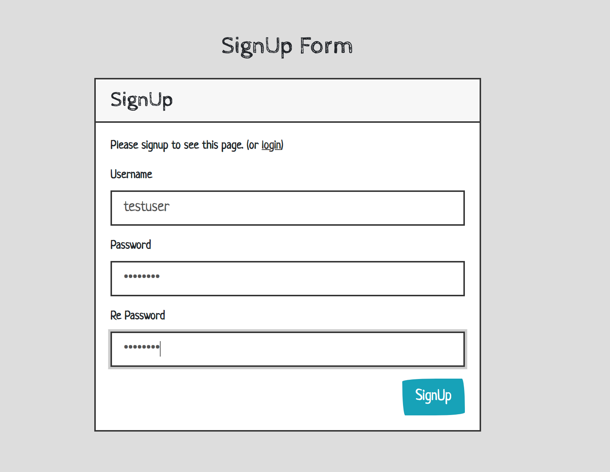
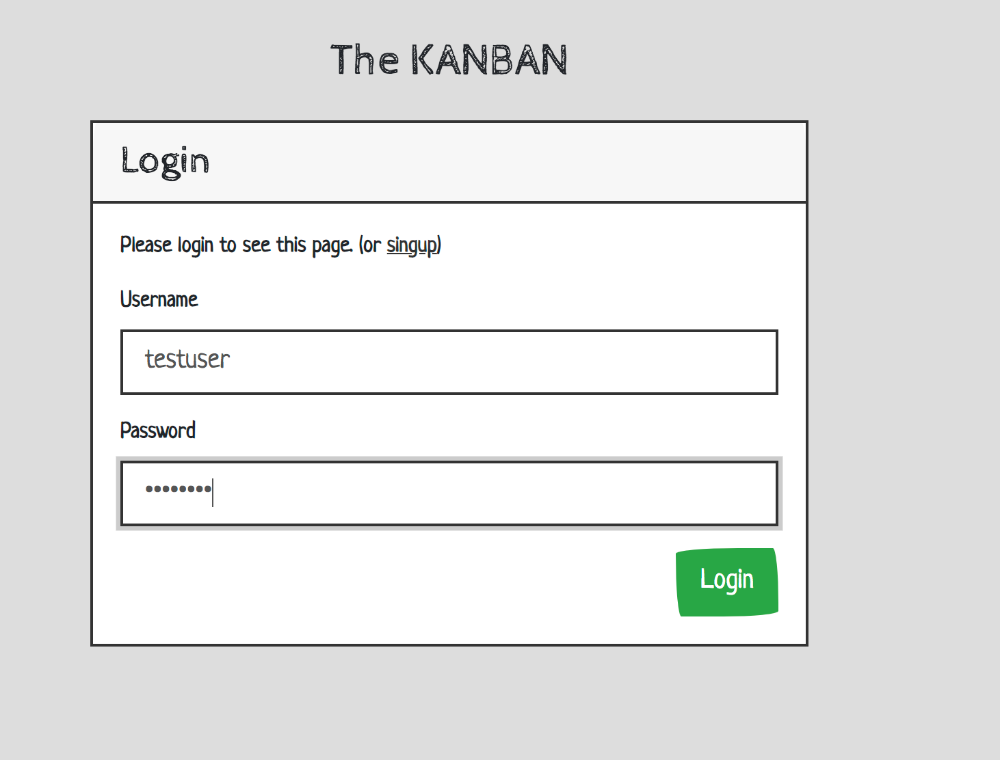
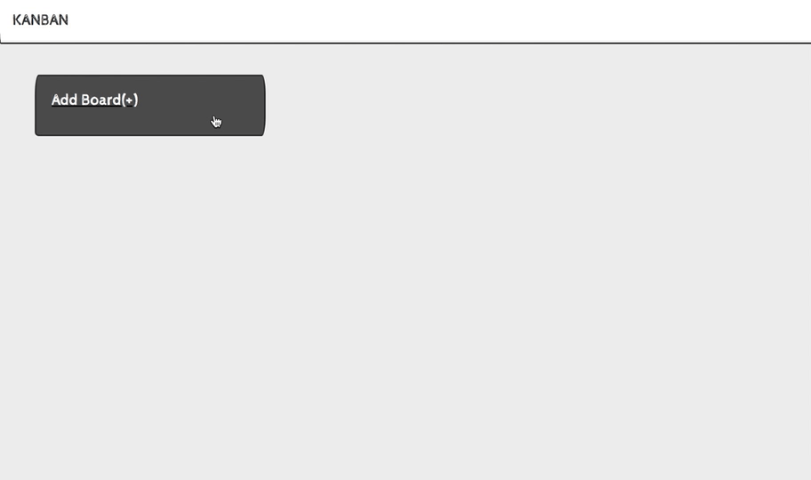
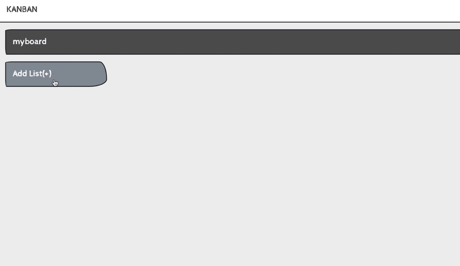
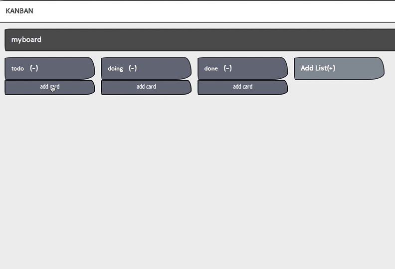
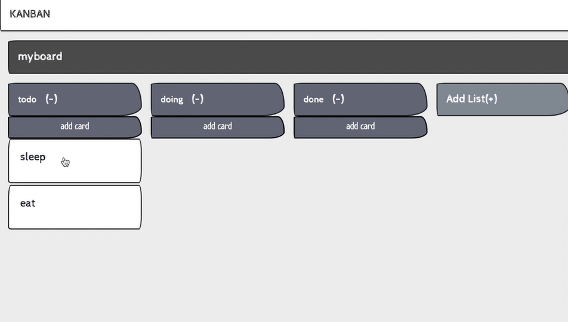

# DjangoDeKanban
Kanban application. (django channels and vue.js)


How To Start
------------

```
$ docker-compose up
```

### containers

|container|role|
|---------|----|
|service  |django|
|service_nginx|nginx|
|db| django backend(postgres)|
|redis| channels backend|
|vuejs| compile *.vue(vuecli)|


How To Use
----------

access `http://localhost:3000`

#### create account



#### login




#### create board




#### create list





#### add card




#### move





run daphne
----------

if you want to run daphne. set `$DJANGO_ENV`.

```
$ export DJANGO_ENV=production
$ docker-compose up  -- run daphne
```

more information, see `docker/service/start-server.sh`.
